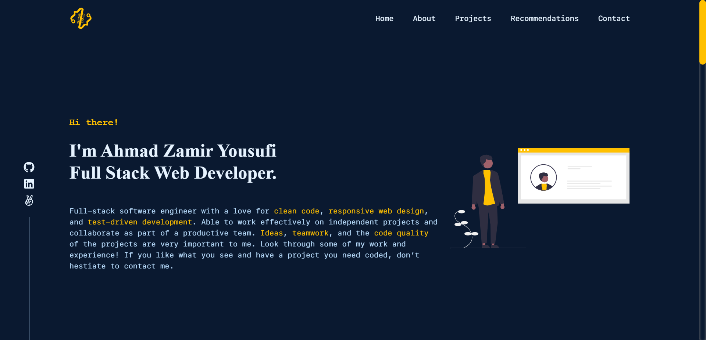

## My Portfolio



> My Portfolio is a project that simulates a portfolio website. It has a home page, about page, projects page, recomendaions page, and contact page. Users can see my projects, recommendations, and contact me.

## Live Demo
- [My Portfolio](http://my-portfolio-ahzamir.vercel.app/)

## Built With

- [x] Programming Language: [JavaScript](https://www.javascript.com/)
- [x] Framework: [React](https://reactjs.org/)
- [x] Framework: [Bootstrap](https://getbootstrap.com/)
- [x] Framework: [React Bootstrap](https://react-bootstrap.github.io/)
- [x] Design: [Material UI](https://material-ui.com/)
- [x] Package: [React Icons](https://react-icons.github.io/react-icons/)
- [x] Linter: [ESLint](https://eslint.org/)
- [x] Code Editor: [VS Code](https://code.visualstudio.com/)

## Getting Started

To get a local copy up and running follow these simple example steps.

1- Clone the repository:
```
$ git clone git@github.com:ahzamir/my-portfolio.git
```
2- Go to the repository folder in your command prompt:
```
$ cd my-portfolio
```
3- You might need to install dependecies with:
```
$ npm install
```
OR
```
$ yarn install
```
7- Go to command line and run the command below for the live server:
```
$ yarn start
```
OR
```
$ npm start
```

### Prerequisites

- [x] A web browser like [Google Chrome](https://www.google.com/chrome/).
- [x] A code editor like [Visual Studio Code](https://code.visualstudio.com/).
- [x] A terminal to run the code.
- [x] [Node.js](https://nodejs.org/en/) installed on your computer.
- [x] [Yarn](https://yarnpkg.com/) installed on your computer.
- [x] [Git](https://git-scm.com/) installed on your computer.

You can check if Git is installed by running the following command in the terminal.
```
$ git --version
```

To check if node is installed, kindly run this command in the terminal.
```
$ node --version
```

To check if yarn is installed, kindly run this command in the terminal.
```
$ yarn --version
```

## Authors

👤 **Ahmad Zamir Yousufi** 

- GitHub: [@ahzamir](https://github.com/ahzamir).
- LinkedIn: [ahzamir](https://www.linkedin.com/in/ahzamir/)
- Portfolio: [ahzamir](http://my-portfolio-ahzamir.vercel.app/)
- Email: [ahmad zamir](mailto:ahmadzamiryousofi1397@gmail.com)

## 🤝 Contributing

Contributions, issues, and feature requests are welcome!

Feel free to check the [issues page](https://github.com/ahzamir/my-portfolio/issues).

## Show your support

Give a ⭐️ if you like this project!

## Acknowledgments

- [Microverse](https://www.microverse.org/)
- Code Reviewers
- Coding Partners

## 📝 License

This project is [MIT](./MIT.md) licensed.


